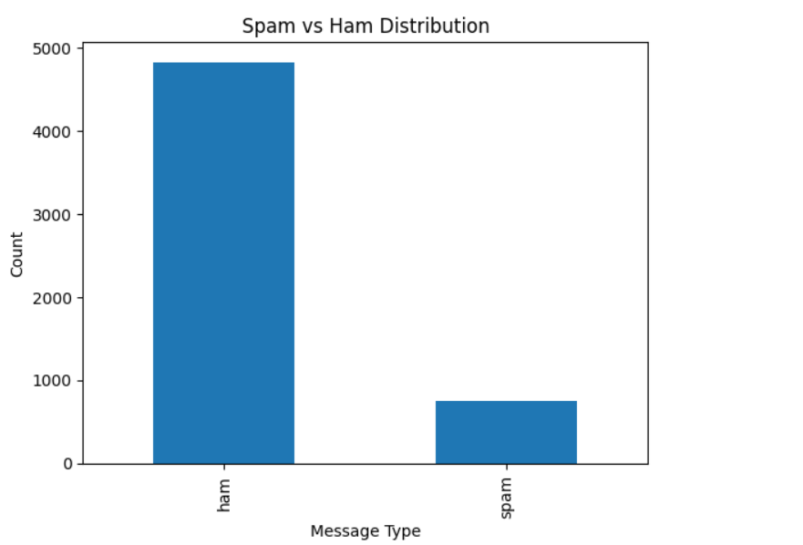
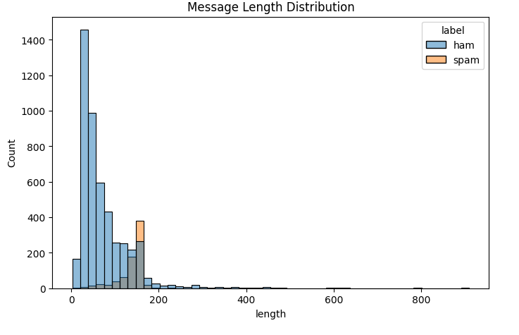
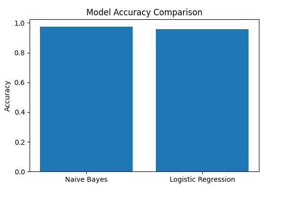
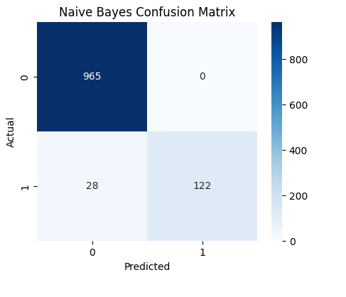
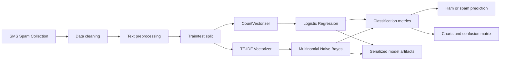

# SMS Spam Detection with NLP and Machine Learning

A complete Natural Language Processing laboratory project for classifying SMS messages as **ham** or **spam**. The project demonstrates text cleaning, feature extraction with Bag-of-Words and TF-IDF, supervised model training, evaluation, visualization, serialized model artifacts and automated repository validation.

## Key Features

- NLP preprocessing for raw SMS messages

- Lowercasing, punctuation removal and stop-word filtering

- Tokenization and normalized text generation

- CountVectorizer and TF-IDF feature extraction

- Multinomial Naive Bayes classification

- Logistic Regression classification

- Accuracy, precision, recall and F1-score evaluation

- Confusion-matrix and class-distribution visualization

- Saved vectorizers and trained model artifacts

- Automated dataset, notebook, model and image validation

- GitHub Actions continuous integration

## Result Gallery

<table>

 <tr>

   <th>Class Distribution</th>

   <th>Message-Length Distribution</th>

 </tr>

 <tr>

   <td></td>

   <td></td>

 </tr>

 <tr>

   <th>Model Accuracy Comparison</th>

   <th>Naive Bayes Confusion Matrix</th>

 </tr>

 <tr>

   <td></td>

   <td></td>

 </tr>

</table>

## System Architecture



## NLP Workflow

1. Load the SMS Spam Collection dataset.

2. Retain the message label and message text columns.

3. Encode `ham` as `0` and `spam` as `1`.

4. Convert text to lowercase.

5. Remove punctuation and unwanted characters.

6. Remove English stop words.

7. Generate cleaned text for model input.

8. Split the dataset into training and testing sets.

9. Convert messages into numerical features.

10. Train Multinomial Naive Bayes and Logistic Regression models.

11. Evaluate both models using classification metrics.

12. visualize the dataset and prediction results.

13. Save the trained models and vectorizers as reusable artifacts.

## Dataset

The project uses the **SMS Spam Collection Dataset** stored at:

```text

data/sms_spam_collection.csv

```

| Property | Value |

|---|---:|

| Total messages | 5,572 |

| Ham messages | 4,825 |

| Spam messages | 747 |

| Ham proportion | 86.59% |

| Spam proportion | 13.41% |

| Original label column | `v1` |

| Original message column | `v2` |

| Task | Binary text classification |

The dataset is imbalanced, with substantially more ham messages than spam messages. Precision, recall and F1-score are therefore reported alongside accuracy.

## Train/Test Configuration

| Setting | Value |

|---|---:|

| Training proportion | 80% |

| Testing proportion | 20% |

| Test messages | 1,115 |

| Random state | 42 |

| Maximum vectorizer features | 3,000 |

## Feature Extraction

### TF-IDF

TF-IDF assigns higher importance to terms that are meaningful within a message while reducing the influence of terms that occur frequently across the corpus.

The saved TF-IDF artifact is:

```text

models/tfidf_vectorizer.pkl

```

### Bag of Words

CountVectorizer represents each message using token-frequency counts.

The saved CountVectorizer artifact is:

```text

models/count_vectorizer.pkl

```

## Model Performance

### Overall Comparison

| Model | Test Accuracy |

|---|---:|

| Multinomial Naive Bayes | **97.49%** |

| Logistic Regression | 95.70% |

Multinomial Naive Bayes achieved the highest recorded test accuracy and is treated as the primary model in this project.

### Multinomial Naive Bayes Report

| Class | Precision | Recall | F1-score | Support |

|---|---:|---:|---:|---:|

| Ham | 0.97 | 1.00 | 0.99 | 965 |

| Spam | 1.00 | 0.81 | 0.90 | 150 |

| Macro average | 0.99 | 0.91 | 0.94 | 1,115 |

| Weighted average | 0.98 | 0.97 | 0.97 | 1,115 |

### Naive Bayes Confusion Matrix

| | Predicted Ham | Predicted Spam |

|---|---:|---:|

| Actual Ham | 965 | 0 |

| Actual Spam | 28 | 122 |

The recorded model produced no false-positive spam classifications in the test set, while 28 spam messages were classified as ham.

### Logistic Regression Report

| Class | Precision | Recall | F1-score | Support |

|---|---:|---:|---:|---:|

| Ham | 0.96 | 1.00 | 0.98 | 965 |

| Spam | 0.97 | 0.70 | 0.81 | 150 |

| Macro average | 0.96 | 0.85 | 0.89 | 1,115 |

| Weighted average | 0.96 | 0.96 | 0.95 | 1,115 |

> These figures reproduce the outputs stored in the notebook. They are not evidence of performance on all real-world SMS traffic.

## Technology Stack

| Area | Technologies |

|---|---|

| Language | Python |

| Data processing | Pandas, NumPy |

| NLP | NLTK |

| Feature extraction | CountVectorizer, TfidfVectorizer |

| Machine learning | scikit-learn |

| Models | Multinomial Naive Bayes, Logistic Regression |

| Visualization | Matplotlib, Seaborn |

| Model persistence | Pickle, Joblib-compatible artifacts |

| Experiment environment | Jupyter Notebook |

| Testing | pytest |

| Automation | GitHub Actions |

## Project Structure

```text

nlp-text-classification/

├── .github/

│   └── workflows/

│       └── tests.yml

├── data/

│   └── sms_spam_collection.csv

├── docs/

│   └── notebook_export.pdf

├── models/

│   ├── count_vectorizer.pkl

│   ├── logistic_regression.pkl

│   ├── multinomial_naive_bayes.pkl

│   └── tfidf_vectorizer.pkl

├── notebooks/

│   └── sms_spam_classification.ipynb

├── outputs/

│   ├── class-distribution.png

│   ├── message-length-distribution.png

│   ├── model-accuracy-comparison.png

│   └── naive-bayes-confusion-matrix.png

├── tests/

│   └── test_repository.py

├── .gitignore

├── requirements.txt

├── requirements-dev.txt

└── README.md

```

## Prerequisites

- Python 3.10 or 3.11 recommended

- Git

- Jupyter Notebook or JupyterLab

- An internet connection for the initial NLTK resource download

The saved scikit-learn artifacts were created with:

```text

scikit-learn==1.6.1

```

Using the pinned version avoids model-persistence compatibility warnings.

## Installation

Clone the repository:

```powershell

git clone https://github.com/kompalwargangotri/nlp-text-classification.git

cd nlp-text-classification

```

Create and activate a virtual environment:

```powershell

py -3.11 -m venv .venv

.\.venv\Scripts\Activate.ps1

```

Install the project dependencies:

```powershell

python -m pip install --upgrade pip

pip install -r requirements.txt

```

For notebook and testing tools:

```powershell

pip install -r requirements-dev.txt

```

## Running the Notebook

Start Jupyter from the repository root:

```powershell

jupyter notebook notebooks/sms_spam_classification.ipynb

```

Run the cells in order to reproduce preprocessing, training, evaluation, charts and saved artifacts.

If NLTK resources are unavailable, run:

```python

import nltk

nltk.download("stopwords")

```

## Using the Saved Naive Bayes Model

The following example loads the saved TF-IDF vectorizer and Naive Bayes classifier:

```python

import pickle

from pathlib import Path

model_dir = Path("models")

with (model_dir / "tfidf_vectorizer.pkl").open("rb") as file:

   vectorizer = pickle.load(file)

with (model_dir / "multinomial_naive_bayes.pkl").open("rb") as file:

   model = pickle.load(file)

messages = [

   "Free prize! Call now to claim your reward",

   "Can we meet after class today?",

]

features = vectorizer.transform(messages)

predictions = model.predict(features)

for message, prediction in zip(messages, predictions):

   label = "spam" if prediction == 1 else "ham"

   print(f"{label}: {message}")

```

> Only load pickle files from trusted sources. Python pickle artifacts can execute code during deserialization.

## Testing

Run the repository validation suite:

```powershell

py -m pytest tests -v

```

The tests verify:

- dataset size and class distribution

- notebook JSON structure

- absence of common GitHub token patterns

- saved TF-IDF and Naive Bayes inference

- expected result-image filenames

- PNG signatures and image dimensions

## Continuous Integration

The GitHub Actions workflow runs automatically for:

- pushes to `main`

- pull requests targeting `main`

It installs the pinned dependencies and executes the complete pytest validation suite on Python 3.11.

## Repository Data Policy

The repository includes:

- the academic SMS dataset

- the reproducible notebook

- the notebook PDF export

- trained model artifacts

- saved vectorizers

- generated evaluation charts

The following files are excluded:

- Python cache files

- local virtual environments

- notebook checkpoints

- IDE configuration

- environment-variable files

- test and coverage caches

- log files

## Security Notes

- No API keys, passwords or access tokens are required.

- `.env` files are excluded from Git.

- Serialized model artifacts should be loaded only from trusted sources.

- SMS messages may contain personal information; use authorized or anonymized data in future experiments.

- A production system should include input validation, monitoring and data-retention controls.

## Limitations

- The dataset is imbalanced toward ham messages.

- The dataset reflects a limited SMS collection and may not represent modern spam campaigns.

- Word-frequency models have limited understanding of context, sarcasm and obfuscated spam.

- The notebook uses a single train/test split.

- The project does not evaluate robustness against adversarial spelling or multilingual messages.

- Saved pickle models depend on compatible Python and scikit-learn versions.

## Future Improvements

- Add stratified cross-validation.

- Compare linear SVM and ensemble models.

- Add class-weighting or resampling experiments.

- Evaluate character-level n-grams for obfuscated spam.

- Compare word embeddings and transformer-based classifiers.

- Add multilingual SMS classification.

- Package preprocessing and prediction into one scikit-learn Pipeline.

- Add a Streamlit or Flask prediction interface.

- Track experiments and model versions.

- Add explainability for individual predictions.

## Ethical Use

This project is intended for education and defensive spam filtering. It should not be used to inspect private communications without authorization or to make high-impact decisions without appropriate human review.

## Author

**Gangotri Kompalwar**

- GitHub: [kompalwargangotri](https://github.com/kompalwargangotri)

- LinkedIn: [Gangotri Kompalwar](https://www.linkedin.com/in/gangotri-kompalwar-4635b9359)

- Portfolio: [Gangotri Kompalwar](https://kompalwargangotri.github.io/)
